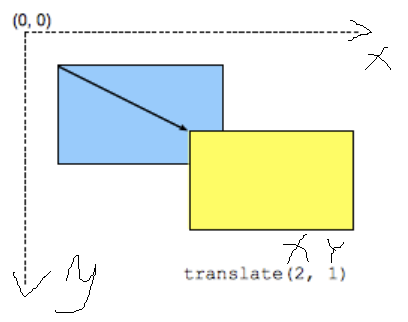

# CSS - Cascading Style Sheets

## Cascade

The order of CSS rules matter! When two rules apply that have **equal specificity** **the one that comes last** in the CSS is the one that will be used.

```css
/* The color of h1 will be blue! */
h1 {
  color: red;
}
h1 {
  color: blue;
}
```

## Specificity

How the browser decides which rule applies if multiple rules have **different selectors**, but could still apply to the same element.

Measure specificity:

- 1000: Score one in this column if the declaration is inside a style attribute, Also known as **inline styles**.

- 100: Score one in this column for each **ID selector** contained inside the overall selector.

- 10: Score one in this column for each **class selector**, **attribute selector**, or **pseudo-class** contained inside the overall selector.

- 1: Score one in this column for each **element selector** or **pseudo-element** contained inside the overall selector.

```css
/* For example => score: 0 0 2 2*/

/* [href*="en-US"], .inline-warning => 2(10)*/
/* li, a => 2(1) */

li > a[href*="en-US"] > .inline-warning {
  color: red;
}
```

## Inheritance

Some CSS property values set on parent elements are inherited by their child elements, and some aren't.

For example: `color` and `font-family` will be inherited, but `width` will not.

## !important

There is a special piece of CSS that you can use to overrule all of the above calculations, however, you should be very careful with using it — `!important`.

This is used to make a particular property and value the most specific thing, thus overriding the normal rules of the cascade.

# Selectors

## Simple selector

- tag name: `p {}`
- id: `#elementId {}`
- class: `.className {}`
- `p.intro`: Selects only `<p>` elements with `class="intro"`.
- group selectors: `div, .className {}`
- `*{}`: universal selector, apply to all elements in the html.

## Combinator selectors

- `div p`: Selects all `<p>` elements **inside** `<div>` elements.
- `div > p`: Selects all `<p>` elements where **the parent** is a `<div>` element.
- `div + p`: Selects the first `<p>` element that are placed **immediately after** `<div>` elements.
- `div ~ p`: Selects every `<p>` element that **are preceded by** a `<div>` element.

  > all p tags which have a div tag **before them** (P tags can't inside div). No mater if there are any other tags between them.

## Pseudo-class selectors:

Selector that **specifies a special state** of the selected element(s).

Pseudo-classes let you apply a style to an element not only in **relation to the content of the document tree**, but also in **relation to external factors** like the history of the navigator (:visited, for example), the status of its content (like :checked on certain form elements), or the position of the mouse (like :hover, which lets you know if the mouse is over an element or not).

- Linguistic pseudo-classes: `:dir`, `:lang`.
- Location: relate to links. `:link`, `visited`, `:target`.
- User action: `:hover`, `:active`, `:focus`.
- Time-dimensional: `:current`, `:past`, `:future`
- Resource state: `:playing`, `:paused`.
- The input: `:autofill`, `:enabled`, `:disabled`, `:checked`...
- Tree-structural: `:nth-child`, `:nth-last-child`...

## Pseudo-elements selectors

Lets you style a **specific part** of the selected element(s).

For example:

- `::after`, `::before`
- `::first-letter`, `::first-line`

## Attribute selectors

- `a[target]{}`: all `a` tags with `target` attribute.
- `a[target="_blank"]{}`: the **value** of the `target` **is** `_blank`.
- `[title~="flower"]{}`: select elements with an attribute whose value is a whitespace-separated list of words, and the list **containing** a specified word. e.g. `title = "fsfd flower fsdfs"`
- `[class|="top"]{}`: exact value, like `class = "top"` or immediately **followed by a hyphen**, like `class = "top-sososo"`.
- `[class^="top"]{}`: attr whose value is **prefixed** (preceded) by value. e.g. `class = "topsasa"`.
- `[class$="test"]`: select elements whose attribute value **ends with** a specified value.
- `[class*="te"]`: select attr whose value contains at least **one occurrence of value within the string**. e.g. `class="dfdtedfd"`
- `[class*="te" i]` or `[class*="te" s]`:

  `i` - case-insensitively.

  `s` - case-sensitively.

# Box Modle

## display

- `inline`: Displays an element as an inline element (like `<span>`). Any height and width properties will have no effect.

- `inline-block`: Displays an element as an inline-level block container. The element itself is formatted as an inline element, but _you can apply height and width values_.

- `inline-flex`: inline-level flex, will not take up the whole width. If there is a `<span>` after, it will show in the same line with this flex.

- `block`: Displays an element as a block element (like `<p>`). It starts on a new line, and _takes up the whole width_.

- `flex`: block-level flex container.
- `grid`: block-level grid container.
- `none`: The element is completely removed.

## Box: Margin, Border, Padding, and Content

> `box-sizing`: border-box, content-box, initial, inherit.
>
> - `box-sizing: border-box`: The width and height properties (and min/max properties) includes content, padding and border.
> - `box-sizing: content-box`: **Default**. The width and height properties (and min/max properties) includes only the content. Border and padding are not included.

- **content**: by default, it could use `width` and `height` to define.
- **margin**: top,right,bottom,left

  > **margin collapsing**: If you have two elements whose margins touch, and both margins are positive, those margins will combine to become one margin, which is the size of the **largest individual** margin. If one margin is negative, the amount of negative value will **subtract** from the total. Where both are negative, the margins will collapse and the largest value will be used.
  >
  > ```css
  > .one {
  >   margin-bottom: 50px;
  > }
  >
  > .two {
  >   margin-top: 30px;
  > }
  >
  > <!-- margin will be 50px -->
  > <p class="one">I am paragraph one.</p>
  > <p class="two">I am paragraph two.</p>
  > ```

  ```css
  *{
     <!-- all four sides -->
     margin: 10px;

     <!-- top&bottom right&left-->
     margin: 10px 10px;

     <!-- top right&left bottom-->
     margin: 10px 10px 10px;

     <!-- top right bottom left -->
     margin: 10px 10px 10px 10px;
  }
  ```

- padding
- border

# Background

## Background colors

## Background images

1. `background-image`

```css
background-image: linear-gradient(rgba(0, 0, 255, 0.5), rgba(255, 255, 0, 0.5)),
  url("../../media/examples/lizard.png");

/* color under image */
```

2. `background-repeat`

   - no-repeat: not repeat.
   - repeat-x: repeat only horizontally.
   - repeat-y: repeat only vertically.
   - repeat: the default; repeat in both directions.

3. `background-size`:
   - `background-size:cover`: the browser will make the image just large enough so that it completely covers the box area while still **retaining its aspect ratio**. In this case, part of the image is likely to end up outside the box.
   - `background-size:contain`: the browser will make the image the right size to fit inside the box. In this case, you may end up with gaps on either side or on the top and bottom of the image, if the aspect ratio of the image is different from that of the box.
   - `length`, `percentage`
4. `background-position`: top, left, right, bottom, length, percentage.

5. Gradient

   - linear-gradient()
   - radial-gradient()
   - repeating-linear-gradient(), repeating-radial-gradient()
   - conic-gradient()

6. `background-attachment`

- scroll
- fixed
- local: so when you scroll the element, the background scrolls with it.

7. **Accessibility**

   If specifying an image, and text will be placed on top of that image, you should also specify a background-color that will allow the text to be legible if the image does not load.

   Screen readers cannot parse background images, therefore they should be purely decoration; any important content should be part of the HTML page and not contained in a background.

# Text Directions

## `writing-mode`

- `horizontal-tb`
- `vertical-rl`
- `vertical-lr`

## `inline-size`, `block-size`

# Overflowing content

Overflow happens when there is too much content to fit in a box.

1. `overflow: visible`: default, content show outside the box.
2. `overflow: hidden`: the content outside the box is not visible.
3. `overflow: scroll`: `overflow-x` and `overflow-y`, show scroll bar all the time.
4. `overflow: auto`: show scroll bar only when it's necessary.
5. `overflow: clip`

# Values and Units

1. Length Unit

   1. Absolute length units: cm, mm, ..., px

   2. Relative length units:
      - 1em: Font size of the parent
      - 1rem: Font size of the root element.
      - 1vw: 1% of the viewport's width.
      - 1vh: 1% of the viewport's height.
      - 1vmin: 1% of the viewport's smaller dimension.
      - 1vmax: 1% of the viewport's larger dimension.

2. percentage

   1. related to the parents.
   2. padding & margin

      When you use margin and padding set in percentages, the value is calculated from the inline size of the containing block — therefore the width when working in a horizontal language. In our example, all of the margins and padding are 10% of the width.

3. min-/max- width/height

# Normalize/Reset CSS

**Normalize CSS** aims to make built-in browser styling consistent across browsers.

**CSS resets** aim to remove all built-in browser styling

# Flexbox

Flexbox is a **one-dimensional** layout method for laying out items in rows or columns. Items flex to fill additional space and shrink to fit into smaller spaces.

## Flex Container

### flex-direction

specifies what direction the main axis runs in — by default this is set to row.

- `flex-direction: row`: x - axio
- `flex-direction: row-reverse`
- `flex-direction: column`: y - axio
- `flex-direction: column-reverse`

### flex-wrap

sets whether flex items are forced onto one line or can wrap onto multiple lines.

- `flex-wrap: nowrap`: feel this is similar to `overflow: visible`.
- `flex-wrap: wrap`
- `flex-wrap: wrap-reverse`

### flex-flow

Combination of `flex-direction` and `flex-wrap`.

Sytanx is: `flex-flow: direction wrapVal`.

For example: `flex-flow: row wrap`. This is equal to `flex-direction: row; flex-wrap: wrap;`

### justify-content

Controls where the **flex items** sit on the **main axis** based on `flex-direction`.

- `space-between`

  The spacing between each pair of adjacent items is the same. The first item is flush with the main-start edge, and the last item is flush with the main-end edge.

- `space-around`

  The spacing between each pair of adjacent items is the same. The empty space before the first and after the last item equals half of the space between each pair of adjacent items.

- `space-evenly`

  The spacing between each pair of adjacent items, the main-start edge and the first item, and the main-end edge and the last item, are all exactly the same.

### align-content

Used to align the **flex lines**. with the `flex-wrap` property set to `wrap`.

### align-items

Controls where the flex items sit on the **cross axis**.

## Flex Items

### flex: grow, shrink and basis

Combination of `flex-grow`, `flex-shrink` and `flex-basis`.

```css
/* one value:
number ? flex-grow:flex-basis*/
flex: 2;
flex: 2px;

/* two value:
First one: flex-grow
second one: number ? flex-shrink: flex-basis
 */

/* flex-grow | flex-basis */
flex: 1 30px;

/* flex-grow | flex-shrink */
flex: 2 2;

/* Three values: flex-grow | flex-shrink | flex-basis */
flex: 2 2 10%;
```

- **flex-grow**

  Specifies how much a flex item will **grow** relative to the rest of the flex items.

  This property specifies how much of the remaining space in the flex container should be assigned to the item (the flex grow factor).

  The remaining space is the size of the flex container minus the size of all flex items' sizes together.

- **flex-shrink**

  Specifies how much a flex item will **shrink** relative to the rest of the flex items.

- **flex-basis**

  Specifies the **initial length** of a flex item.

### order

Specifies the order of the flex items.

```html
<div class="flex-container">
  <div style="order: 3">1</div>
  <div style="order: 2">2</div>
  <div style="order: 4">3</div>
  <div style="order: 1">4</div>
</div>
<!-- show: 4 2 1 3 -->
```

### align-self

Specifies the alignment for the selected item inside the flexible container.

- `auto`: Default. The element inherits its parent container's align-items property, or "stretch" if it has no parent container.

- `stretch`: The element is positioned to fit the container.

- `center`: The element is positioned at the center of the container.

- `flex-start`: The element is positioned at the beginning of the container.

- `flex-end`: The element is positioned at the end of the container.

- `baseline`: The element is positioned at the baseline of the container.

# Grid

CSS Grid Layout is a **two-dimensional** layout system for the web. It lets you lay content out in rows and columns, and has many features that make building complex layouts straightforward.

## Grid Container

### create rows and columns

- `grid-template-columns` & `grid-template-rows`

```CSS
.container {
    display: grid;
    grid-template-columns: 200px 200px 200px;

    /* OR */

    grid-template-columns: 1fr 1fr 1fr;

    /* OR */
    grid-template-columns: repeat(3, 1fr);
}
```

- `grid-auto-rows` & `grid-auto-columns`

```CSS
.container {
  display: grid;
  grid-template-columns: repeat(3, 1fr);
  grid-auto-rows: 100px;

  /* OR */
  grid-auto-rows: minmax(100px, auto);
}
```

### gap

`column-gap` for gaps between columns, `row-gap` for gaps between rows, and `gap` to set both at once.

```css
.container {
  display: grid;
  grid-template-columns: 2fr 1fr 1fr;
  gap: 20px;
}
```

### justify-content

### align-content

## Grid Item

### grid-column

A shorthand for `grid-column-end` and `grid-column-start`.

```CSS
.item1 {
   /* From curent line number, and occupy 2 cells */
  grid-column: span 2;

  /* show in the cell with line number 4 */
  grid-column: 4;

   /* grid-column-start / grid-column-end */
  /* show from line 1 to line 2, before line 3 */
  grid-column: 1 / 3;

  /* from end to line 2, include the cell with line 2 */
  grid-column: 2 / -1;

  /* start from line 1, occupy 2 cells */
  grid-column: 1 / 2;
}
```

### grid-row

`grid-row-start` and `grid-row-end`. The syntax is the same as `grid-column`.

### grid-area

Can be used as a shorthand property for the `grid-row-start`, `grid-column-start`, `grid-row-end` and the `grid-column-end` properties.

```CSS
.item8 {
   /* grid-row-start/grid-column-start/grid-row-end/grid-column-end  */
  grid-area: 1 / 2 / 5 / 6;

/* row-start/column-start/row-span/column-span */
  grid-area: 2 / 1 / span 2 / span 3;
}
```

### `grid-template-areas`

Give names to `grid-area`

```CSS
.container {
  display: grid;
  grid-template-areas:
      "header header"
      "sidebar content"
      "footer footer";
  grid-template-columns: 1fr 3fr;
  gap: 20px;
}

header {
  grid-area: header;
}

article {
  grid-area: content;
}

aside {
  grid-area: sidebar;
}

footer {
  grid-area: footer;
}
```

# Float

The float property allow web developers to implement simple layouts involving an element floating inside a column of text, with the text wrapping around the left or right of it.

## `float`

- `float: left`
- `float: right`
- `float: none`

## clear floats

`clear` sets whether an element must be moved below (cleared) floating elements that precede it.

e.g. Apply `clear` to `p_2`.

```html
<div class="float_div">I'm a float</div>

<p class="p_1">Lorem ipsum dolor sit amet consectetur</p>

<p class="p_2">Lorem ipsum dolor sit amet consectetur</p>
```

- `none`
- `left`: The element is pushed below left floated elements
- `right`: The element is pushed below right floated elements
- `both`: The element is pushed below both left and right floated elements

When clearing floats, you should match the clear to the float: If an element is floated to the **left**, then you should clear to the **left**. Your floated element will continue to float, but the cleared element will appear below it on the web page.

## clearfix

Deal with situations that you have a tall float and a short paragraph, with a box wrapped around both elements.

To make the box match the height of the float.

```html
<!-- 1. use overflow: auto -->
<style>
  .clearfix_box {
    background-color: rgb(79, 185, 227);
    padding: 10px;
    color: #fff;
    /* overflow: auto; */
    display: flow-root;
  }
</style>
<!-- 2. use display: flow-root -->

<div class="clearfix_box">
  <div class="float_div">I'm a float</div>
  <p>Lorem ipsum dolor sit amet</p>
</div>
<p>Lorem ipsum dolor sit amet</p>
```

# Positioning

## `position:static`

The default that every element gets, it just means "put the element into its normal position in the document layout flow — nothing special to see here."

## `position: relative`

Once the positioned element has taken its place in the normal layout flow, you can then modify its final position: `left`,`right`,`top`,`bottom` based on its own position.

```CSS
p {
   background-color: cadetblue;
   border: 2px solid rebeccapurple;
}
.p2 {
   position: relative;
   top: 50px;
   left: 10px;
}
```

## `position: absolute`

An absolutely positioned element no longer exists in the normal document layout flow. Instead, it sits on its own layer separate from everything else.

`top`... move relative to its nearest positioned ancestor

## `position: fixed`

fixed positioning usually fixes an element in place relative to the visible portion of the viewport, except if one of its ancestors is a fixed containing block.

It will not move when scroll the page.

## `position: sticky`

This is basically a hybrid between relative and fixed position, which allows a positioned element to act like it is relatively positioned until it is scrolled to a certain threshold point, after which it becomes fixed.

> need to define `top`... to make `sticky` work.

## `z-index`

`z-index` values affect where positioned elements sit on that axis; positive values move them higher up the stack, and negative values move them lower down the stack.

# Media Query

```css
@media media-type and (media-feature-rule) {
  /* CSS rules go here */
}
```

- media-type:
  - all: Default. Used for all media type devices
  - print: Used for printers
  - screen: Used for computer screens, tablets, smart-phones etc.
  - speech: Used for screenreaders that "reads" the page out loud
- media-feature-rule:
  - max-/min-width
  - orientation: landscape/portrait(default)

```css
div {
  background-color: salmon;
}

@media screen and (min-width: 700px) {
  /* will show green when width >= 700 */
  div {
    background-color: springgreen;
  }
}
```

# Best Practices for CSS

Some best practices for writing your CSS to make it easily maintainable, and some of the solutions you will find in use by others to help improve maintainability.

## Tips to keep your CSS tidy

1. Follow the coding style guide for an existing project.

   The team style guide should always win over your own personal preferences. There often isn't a right or wrong way to do things, but **consistency is important**.

2. Keep it consistent.

   Consistency of coding style:

   - the same naming conventions for classes,
   - choosing one method of describing color
   - or maintaining consistent formatting (for example will you use tabs or spaces to indent your code? If spaces, how many spaces?)

3. Formatting readable CSS.

   Have each property and value pair on a new line to make CSS files more readable.

4. Comment your CSS.

5. Create logical sections in your stylesheet.

   Divide stylesheet into different setions:

   - general styles: `body`, `p`
   - utility classes
   - sitewide: basic page layout, logo
   - pages: broken down by the context, page...

6. Avoid overly-specific selectors

   Avoid things like `article.main p.box{}`. Use a class selector to enable other element re-use this style rule.

7. Break large stylesheets into multiple smaller ones

## Other tools that can help

1. CSS methodologies

   - [OOCSS](https://github.com/stubbornella/oocss/wiki) (Object Oriented CSS): separate your CSS into reusable objects.

   - BEM (Block Element Modifier): naming principle. class name `btn--big` for parent, class name `btn__text` for children.

2. pre-processor and post-processor

   A **pre-processor** runs over your raw files and turns them into a stylesheet, whereas a **post-processor** takes your finished stylesheet and does something to it — perhaps to optimize it in order that it will load faster.

   - pre-processor: Sass

# `translate`

`transform: translate(30%, 200px)`



# `transform`

`transform` lets you rotate, scale, skew, or translate an element. It modifies the coordinate space of the CSS visual formatting model.
