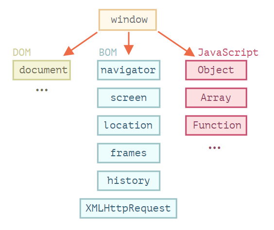
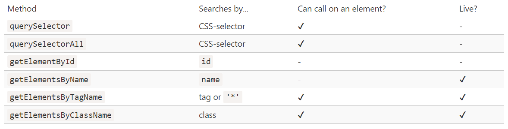
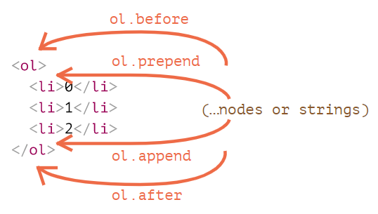

# The JavaScript language

## Objects: the basics

### `Object.assign`

Create an independent copy, a clone of an object:

`Object.assign(dest, [src1, src2, src3...])`

```js
let user = { name: "John" };

let permissions1 = { canView: true };
let permissions2 = { canEdit: true };

// copies all properties from permissions1 and permissions2 into user
// now user = { name: "John", canView: true, canEdit: true }
Object.assign(user, permissions1, permissions2);

// now user = { name: "Pete" } => re-write
Object.assign(user, { name: "Pete" });
```

### Garbage collection

- Garbage collection is performed automatically. We cannot force or prevent it.
- Objects are retained in memory while they are reachable.
- Being referenced is not the same as being reachable (from a root): a pack of interlinked objects can become unreachable as a whole.

### Optional chaining '?.'

The optional chaining `?.` stops the evaluation if the value **before** `?.` is undefined or null and returns `undefined`.

```js
let user = {};
const res = user?.address; // return undefined if user is null/undefined
```

### [Symbol type](https://javascript.info/symbol)

It's used as the key in object, unique and can't show in `for..in..` loop.

`let id = Symbol();`

## Data types

### Array

- `arr.push()`
- `arr.pop()` – extracts an item from the end,
- `arr.shift()` – extracts an item from the beginning,
- `arr.unshift(...items)` – adds items to the beginning.
- `arr.splice`

  ```js
  let arr = ["I", "study", "JavaScript", "right", "now"];

  // remove 3 first elements and replace them with another
  arr.splice(0, 3, "Let's", "dance");

  alert(arr); // now ["Let's", "dance", "right", "now"]
  ```

- `arr.slice([start], [end])`
- `arr.concat(arg1, arg2...)`
- indexOf,includes,findIndex
- find, filter, reduce
- split, join, sort, reverse

### WeakMap and WeakSet

- The first difference between `Map` and `WeakMap` is that keys must be objects, not primitive values.
- In `WeakMap`, if we use an object as the key in it, and there are no other references to that object – it will be removed from memory (and from the map) automatically. But in `Map`, it will not be removed from memory.

- `WeakMap` does not support iteration and methods `keys()`, `values()`, `entries()`, so there’s no way to get all keys or values from it.

### Object.keys, values, entries

- `Object.keys(obj)` – returns an array of keys.
- `Object.values(obj)` – returns an array of values.
- `Object.entries(obj)` – returns an array of [key, value] pairs.

### Destructuring assignment

**Destructuring assignment** is a special syntax that allows us to “unpack” arrays or objects into a bunch of variables.

- Array

  ```js
  let arr = ["John", "Smith"];

  let [firstName, surname] = arr;
  ```

- Object
- Nested

## Advanced working with functions

### Recursion

When a function calls itself, that's called recursion.

```js
function pow(x, n) {
  if (n == 1) {
    return x;
  } else {
    return x * pow(x, n - 1);
  }
}
```

- the _base_ of recursion: `if (n == 1) return x`
- a _recursive step_: `x * pow(x, n - 1)`
- recursion depth: `n`

### Spread syntax `...`

```js
function sumAll(...args) {
  // args is the name for the array
  let sum = 0;

  for (let arg of args) sum += arg;

  return sum;
}
```

### Closure

A **closure** is a function that remembers its outer variables and can access them.

So all functions are naturally closures in Javascript. Because of the hidden property `[[Environment]]`.

It keeps the reference to the Lexical Environment where the function was created which means all functions could know their outer Lexical Environment reference from their `[[Environment]]` property and have access to the outer variables.

```js
function sum(a) {
  return function (b) {
    return a + b; // takes "a" from the outer lexical environment
  };
}

alert(sum(1)(2)); // 3
alert(sum(5)(-1)); // 4
```

### `setTimeout`

Any `setTimeout` will run only after the current code has finished.

```js
let i = 0;

setTimeout(() => alert(i), 100); // 100000000

// assume that the time to execute this function is >100ms
for (let j = 0; j < 100000000; j++) {
  i++;
}
```

### `.call`, `.apply` and `.bind`

To set `this` context.

- **bind**: returns a function which will act like the original function but with this predefined.

  `let bindPokemon = pokemonName.bind(pokemon); `
  `bindPokemon("sushi", "js");`

---

**call** and **apply** will call a function immediately letting you specify both the value of this and any arguments the function will receive.

- **call**: `func.call(context, arg1, arg2, ...)`
- **apply**: `func.apply(context, [arg1, arg2, ...])`

## Object properties configuration

### Property flags and descriptors

- `writable`
- `enumerable`
- `configurable`

---

- `Object.getOwnPropertyDescriptor(obj, propertyName)`
- `Object.defineProperty(obj, propertyName, descriptor)`

### Property getters and setters

```js
let user = {
  name: "John",
  surname: "Smith",

  get fullName() {
    return `${this.name} ${this.surname}`;
  },

  set fullName(value) {
    [this.name, this.surname] = value.split(" ");
  },
};

// set fullName is executed with the given value.
user.fullName = "Alice Cooper";

alert(user.name); // Alice
alert(user.surname); // Cooper
```

## Prototypes, Inheritance ?? 没看完

### Prototypal inheritance

We'd like to reuse what we have in an exist object, not copy/reimplement its methods, just build a new object on top of it. **Prototypal inheritance** is a language feature that helps in that.

- `[[Prototype]]`

  In JavaScript, objects have a special hidden property `[[Prototype]]`, that is either null or references another object. That object is called _"a prototype"_.

  When we read a property from `object`, and it’s missing, JavaScript automatically takes it from the prototype. In programming, this is called _"prototypal inheritance"_.

  > We can use `obj.__proto__ = parentObject`.

- `F.prototype`

  ```js
  let animal = {
    eats: true,
  };

  function Rabbit(name) {
    this.name = name;
  }

  Rabbit.prototype = animal;

  let rabbit = new Rabbit("White Rabbit"); //  rabbit.__proto__ == animal

  alert(rabbit.eats); // true
  ```

## Classes

## Promises, async/await

### "error-first callback"

```js
function loadScript(src, callback) {
  let script = document.createElement("script");
  script.src = src;

  script.onload = () => callback(null, script);
  script.onerror = () => callback(new Error(`Script load error for ${src}`));

  document.head.append(script);
}

loadScript("/my/script.js", function (error, script) {
  if (error) {
    // handle error
  } else {
    // script loaded successfully
  }
});
```

### "callback hell" or "pyramid of doom"

callback nested in callback.

**Solution**:

1. Make every action a standalone function.

```js
loadScript('1.js', step1);

function step1(error, script) {
  if (error) {
    handleError(error);
  } else {
    // ...
    loadScript('2.js', step2);
  }
}

function step2(error, script) {
  if (error) {
    handleError(error);
  } else {
    // ...
    loadScript('3.js', step3);
  }
}

...
}
```

### 2. Promise

- Promise: state => pending/settled(fullfilled/rejected)

  ```js
  let promise = new Promise(function (resolve, reject) {
    // excute functions which will take time
    resolve(result);
    // or
    reject(new Error("Whoops!"));
  });

  promise.then();
  promise.then();
  promise.catch();
  ```

  - `resolve`/`reject` => will only take first one and ignor code below them.

  - `.then()` => triggered when state to be fullfilled

    could use `.then()` to modify result many times
    give us better code flow and flexibility.

  - `.finally()` => will excute anyway. doesn't need result of resolve or reject, will pass them into next then or catch

  - `.catch()` => triggered when state to be rejected.

    We should place `.catch` exactly in places where we want to handle errors and know how to handle them. The handler should analyze errors (custom error classes help) and **rethrow** unknown ones (maybe they are programming mistakes).

- Promise chaining
  ```js
  loadScript("one.js")
    .then((script) => loadScript("two.js"))
    .then((script) => loadScript("three.js"))
    .then((script) => {
      // scripts are loaded, we can use functions declared there
      one();
      two();
      three();
    })
    .catch((error) => alert(error.message));
  ```
- Promise API

  - Promise.all

    `let promise = Promise.all([promise1,promise2,...]);`

    Let promises to execute in _parallel_ and wait until all of them are ready.

    Takes an array of promises and returns a new promise.**The order** of the resulting array members **is the same as in its source promises**. Even though the first promise takes the longest time to resolve, it’s still first in the array of results.

    If any of the promises is rejected, the promise returned by `Promise.all` **immediately rejects** with that error.

  - Promise.allSettled

    `Promise.allSettled` just waits for all promises to settle, regardless of the result.

    ```js
    Promise.allSettled(urls.map((url) => fetch(url))).then((results) => {
      // (*)
      results.forEach((result, num) => {
        if (result.status == "fulfilled") {
          alert(`${urls[num]}: ${result.value.status}`);
        }
        if (result.status == "rejected") {
          alert(`${urls[num]}: ${result.reason}`);
        }
      });
    });
    ```

  - Promise.race

    `let promise = Promise.race(iterable)`

    Return the first(**fastest**) settled promise and gets its result (or error).

    All further results/errors are ignored.

  - Promise.any

    Return only for the **first fulfilled** promise and gets its result.

  - Promise.resolve/reject

    `Promise.resolve(value)` is the same as use `resolve` in `new Promise(()=>{})`

    `Promise.reject(error)`

- promisify(func)
  ```js
  const util = require("util");
  var read = util.promisify(fs.readFile);
  ```

### 3. Async/await

```js
async function f() {
  try {
    let result = await fetch(url);
  } catch (err) {
    console.log(err);
  }
}
```

## Generators, advanced iteration

### Generators

Generators can return (“yield”) multiple values, one after another, on-demand. They work great with iterables, allowing to create data streams with ease.

```js
function* generateSequence() {
  yield 1;
  yield 2;
  return 3;
}

let generator = generateSequence();

let one = generator.next();

alert(JSON.stringify(one));
// {value: 1, done: false}
alert(JSON.stringify(generator.next()));
// {value: 2, done: false}
alert(JSON.stringify(generator.next()));
// {value: 3, done: true}
```

## Modules

- AMD – one of the most ancient module systems, initially implemented by the library require.js.
- CommonJS – the module system created for Node.js server.
- UMD – one more module system, suggested as a universal one, compatible with AMD and CommonJS.

### Export & Import

- Named export
- Default export
- re-export

  ```js
  export {default [as y]} from "module"
  ```

### Dynamic imports

`let obj = await import('./say.js');`

`let {hi, bye} = await import('./say.js');`

## Miscellaneous

### [Proxy and Reflect](https://javascript.info/proxy#summary)

`Proxy` is a wrapper around an object, that forwards operations on it to the object, optionally trapping some of them.

`Reflect` is a built-in object that simplifies creation of Proxy.

### Eval: run a code string

The built-in `eval` function allows to execute a string of code.

```js
let code = 'alert("Hello")';
eval(code); // Hello
```

### Currying

Currying is a transform that makes f(a,b,c) callable as f(a)(b)(c).

```js
function curry(f) {
  // curry(f) does the currying transform
  return function (a) {
    return function (b) {
      return f(a, b);
    };
  };
}

// usage
function sum(a, b) {
  return a + b;
}

let curriedSum = curry(sum);

alert(curriedSum(1)(2)); // 3
```

# Browser: Document, Events, Interfaces

## Document

### Browser environment, specs



- There's a "root" object called `window`.
- DOM (Document Object Model)

  DOM represents all page content as objects that can be modified.

- BOM (Browser Object Model)

  BOM represents additional objects provided by the browser (host environment) for working with everything except the document.

### DOM tree

Every HTML tag is an object. Nested tags are “children” of the enclosing one. The text inside a tag is an object as well.

**Everything in HTML, even comments, becomes a part of the DOM.**

All operations on the DOM start with the `document` object. That's the main "entry point" to DOM.

- For all nodes

  `parentNode`, `childNodes`, `firstChild`, `lastChild`, `previousSibling`, `nextSibling`.

- For element nodes only

  `parentElement`, `children`, `firstElementChild`, `lastElementChild`, `previousElementSibling`, `nextElementSibling`.

- Search for nodes in DOM

  

- `elem.matches(CSS-selector)`

  check if `elem` matches the given CSS selector.

- `elem.closest(CSS-selector)`

  look for the nearest ancestor that matches the given CSS-selector. The `elem` itself is also checked.

- `elemA.contains(elemB)`

  returns true if `elemB` is inside `elemA` (a descendant of `elemA`) or when `elemA == elemB`.

### Modifying the document

- `document.createElement(tag)`

  ```js
  // 1. Create <div> element
  let div = document.createElement("div");

  // 2. Set its class to "alert"
  div.className = "alert";

  // 3. Fill it with the content
  div.innerHTML =
    "<strong>Hi there!</strong> You've read an important message.";
  ```

- Insertion and removal:

`.append()`, `.prepend()`, `.before()`, `.after()`, `.replaceWith()`, `.remove()`



### Element size and scrolling

https://javascript.info/size-and-scroll#summary

### Window sizes and scrolling

- Read the current scroll: `window.pageYOffset/pageXOffset`.

- Change the current scroll:

  - `window.scrollTo(pageX,pageY)` – absolute coordinates,
  - `window.scrollBy(x,y)` – scroll relative the current place,
  - `elem.scrollIntoView(top)` – scroll to make elem visible (align with the top/bottom of the window).

## Introduction to Events

### `addEventListener`

`element.addEventListener(event, handler, [options])`

- `event`: Event name, e.g. "click".
- `handler`: The handler function.
- `options`:
  - `once`: if true, then the listener is automatically removed after it triggers.
  - `capture`: the phase where to handle the event, to be covered later in the chapter Bubbling and capturing. For historical reasons, options can also be false/true, that’s the same as {capture: false/true}.
  - `passive`: if true, then the handler will not call `preventDefault()`

### Bubbling and capturing

1. Bubbling: inner => outer

   When an event happens on an element, it first runs the handlers on it, then on its parent, then all the way up on other ancestors.

   ```html
   <!-- If you click <p> -->
   <!-- it will show: p->div->form -->
   <form onclick="alert('form')">
     FORM
     <div onclick="alert('div')">
       DIV
       <p onclick="alert('p')">P</p>
     </div>
   </form>
   ```

   > **Stopping bubbling**
   >
   > use `event.stopPropagation()` in the inner element.

2. Capturing: outer => inner

   ```html
   <form>
     FORM
     <div>
       DIV
       <p>P</p>
     </div>
   </form>

   <!-- HTML → BODY → FORM → DIV -> P -->
   <script>
     for (let elem of document.querySelectorAll("*")) {
       elem.addEventListener(
         "click",
         (e) => alert(`Capturing: ${elem.tagName}`),
         true
       );
   </script>
   ```

   > `elem.addEventListener(..., {capture: true})`
   >
   > `{capture: true}`: the handler is set on the capturing phase. => enable the capturing.
   >
   > `{capture: false}`: the handler is set on the bubbling phase.=> diable the capturing.

### Event delegation

The idea is that if we have a lot of elements handled in a similar way, then instead of assigning a handler to each of them – we put a single handler on their common ancestor.

The algorithm:

- Put a single handler on the container.
- In the handler – check the source element event.target.
- If the event happened inside an element that interests us, then handle the event.

### [Browser default actions](https://javascript.info/default-browser-action)

There are two ways to tell the browser we don’t want it to act:

- The main way is to use the event object. There’s a method `event.preventDefault()`.
- If the handler is assigned using on<event> (not by addEventListener), then returning false also works the same.

### Dispatching custom events

## UI Events

### Moving the mouse

- `mousemove`/`mouseout`: will be triggered when move from parent to child, enable Bubbling.
- `mouseenter`/`mouseleave`: only triggered when enter the parent, don't care if you have enterned child or not, doesn't allow bubbing.

## Document and resource loading

The lifecycle of an HTML page has three important events:

- `DOMContentLoaded` – the browser fully loaded HTML, and the DOM tree is built, but external resources like pictures  and stylesheets may not yet have loaded.
- `load` – not only HTML is loaded, but also all the external resources: images, styles etc.
- `beforeunload`/`unload` – the user is leaving the page.

# Storing data in the browser

## Cookies
