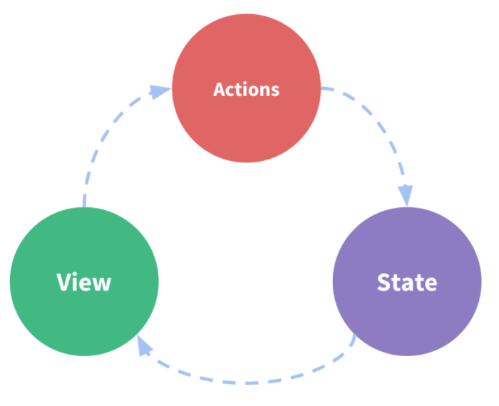
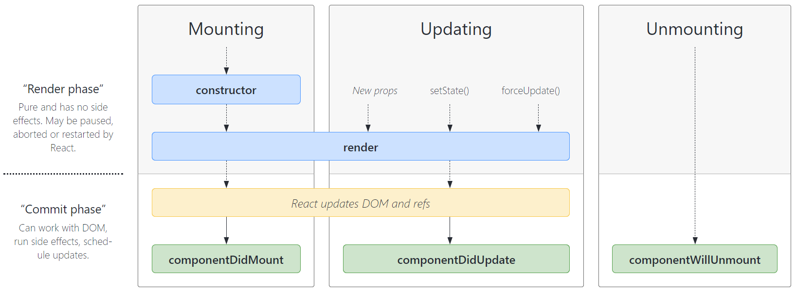
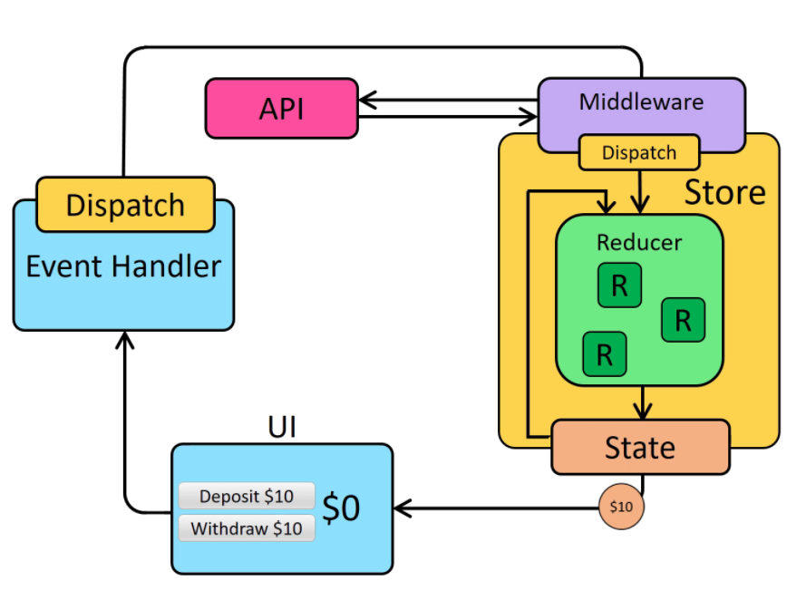
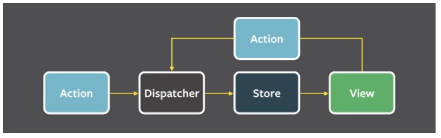

# React Basic

## Virtual DOM

### What is virtual DOM?

The Virtual DOM is an in-memory representation of Real DOM. The representation of a UI is kept in memory and synced with the "real" DOM. It's a step that happens between the render function being called and the displaying of elements on the screen. This entire process is called reconciliation.

### How it works?

## JSX

JSX is a XML-like syntax extension to ECMAScript (the acronym stands for JavaScript XML). Basically it just provides syntactic sugar for the `React.createElement()` function, giving us expressiveness of JavaScript along with HTML like template syntax.

Can't processed in Browser directly. Hence there is a need to convert this JSX into something which the browser can understand using **Bable**. And Babel will already be there for us in our app automatically.

## Immutability

**React elements are immutable**. Once you create an element, you can’t change its children or attributes. An element is like a single frame in a movie: it represents the UI at a certain point in time.

With our knowledge so far, **the only way to update the UI is to create a new element, and pass it to `ReactDOM.render()`**.

## Functional component

Always the best choice => smaller & faster and use hooks.

## Class component

Use constructor. Need to bind in order to use `this` if use narmal function rather than arrow function.

- Why we need to `super(props)` in the beginning?

  The **constructor** for a React component is called before it is mounted. When implementing the constructor for a `React.Component` subclass, you should call `super(props)` before any other statement. **Otherwise, this.props will be undefined in the constructor, which can lead to bugs**.

## State Updates

- Do Not Modify State Directly, use `setState`.
- State Updates May Be Asynchronous.

  `setState()` does not always immediately update the component. It may batch or defer the update until later. This makes reading this.state right after calling `setState()` a potential pitfall.

  ```js
  this.setState((state, props) => {
    return { counter: state.counter + props.increment };
  });
  ```

- State Updates are Merged.

  If your state may contain several independent variables, you can update them independently with separate setState() calls.

  ```js
  this.setState({
    posts: response.posts,
  });
  this.setState({
    comments: response.comments,
  });
  ```

  The merging is shallow, so `this.setState({comments})` leaves `this.state.posts` intact, but completely replaces `this.state.comments`.

> `setState(updater, [callback])`
>
> - `updater`: An updater function with the signature: `(prevState,props) => ({count: prevState + 1})` or an object: `{count: 5}`.
>   <br> If the cout is an object and you just want to modify part of it or add one property. Try: `{ count : {...prevState.count, count_pro:"sample"}}`.
> - `callback`: The second parameter to `setState()` is an optional callback function that will be executed once `setState` is completed and the component is re-rendered. Generally we recommend using `componentDidUpdate()` for such logic instead.

## Unidirectional Data Flow

This is commonly called a **"top-down" or "unidirectional" data flow**. Any state is always owned by some specific component, and any data or UI derived from that state can only affect components “below” them in the tree.

> I think unidirectional data flow means: data is always from parent components to child components, never from child components to parent components.
>
> state => view => click/action => to change state => re-render the view

.

## Lifecycle

Mounting, Updating, Unmounting, Error Handling



### Mounting

When an instance of a component is being created and inserted into the DOM.

1. **`constructor()`**

   called before it is mounted

2. `static getDerivedStateFromProps()`
3. **`render()`**
4. **`componentDidMount()`**

### Updating

An update can be caused by changes to props or state.

1. `static getDerivedStateFromProps()`
2. `shouldComponentUpdate()`
3. **`render()`**
4. `getSnapshotBeforeUpdate()`
5. **`componentDidUpdate()`**

### Unmounting

When a component is being removed from the DOM.

1. **`componentWillUnmount()`**

   Perform any necessary cleanup in this method, such as invalidating timers, canceling network requests, or cleaning up any subscriptions that were created in `componentDidMount()`.

   You should **not call `setState()`** in componentWillUnmount() because the component will never be re-rendered.

### Error Handling

Also called **Error Boundaries**

These methods are called when there is an error during rendering, in a lifecycle method, or in the constructor of any child component.

Only use error boundaries for recovering from unexpected exceptions; **don’t try to use them for control flow.**

1. `static getDerivedStateFromError()`

   Render a fallback UI after an error has been thrown.

2. `componentDidCatch()`

   Log error information.

```js
export class ErrorBoundary extends React.Component {
  constructor(props) {
    super(props);
    this.state = { hasError: false };
  }

  static getDerivedStateFromError(error) {
    // Update state so the next render will show the fallback UI.
    return { hasError: true };
  }

  componentDidCatch(error, errorInfo) {
    // You can also log the error to an error reporting service
    logErrorToMyService(error, errorInfo);
  }

  render() {
    if (this.state.hasError) {
      // You can render any custom fallback UI
      return <h1>Something went wrong.</h1>;
    }

    return this.props.children;
  }
}
```

```js
// usage
<ErrorBoundary>
  <MyWidget />
</ErrorBoundary>
```

## SyntheticEvent

`SyntheticEvent` is a cross-browser wrapper around the browser's native event. It's API is same as the browser's native event, including `stopPropagation()` and `preventDefault()`, except the events work identically across all browsers.

## Conditional Rendering

In React, you can create distinct components that encapsulate behavior you need. Then, you can render only some of them, depending on the state of your application.

Use `if` statement, conditional operator (`expression ? true:false`) or `{true && JSX_expression}`

## Controlled vs. Uncontrolled Components

### Controlled Components

React component that renders a form also controls what happens in that form on subsequent user input. An input form element whose value is controlled by React in this way is called a **controlled component**.

React state is the"single source of truth".

### Uncontrolled Components

The source of truth in the DOM.

The **Uncontrolled Components** are the ones that store their own state internally, and you query the DOM using a `ref` to find its current value when you need it. This is a bit more like traditional HTML.

## Composition vs. Inheritance

Recommend using composition instead of inheritance to **reuse code** between components.

## [Accessibility](https://reactjs.org/docs/accessibility.html)

- WCAG (Web Content Accessibility Guidelines)
- `aria-*`

  Accessible Rich Internet Applications (ARIA) is a set of attributes that define ways to make web content and web applications (especially those developed with JavaScript) more accessible to people with disabilities.

- Semantic HTML

- Labeling: Always add labels to `<input>` to provide descriptive labels that are also exposed to screen readers.

- Notifying the user of errors.

- Focus Control: Ensure that your web application can be fully operated with the keyboard only.

## Code Spliting

Code-Splitting is a feature supported by bundlers like Webpack and Browserify which can create multiple bundles that can be dynamically loaded at runtime. The react project supports code splitting via dynamic import() feature.

Code-splitting your app can help you “lazy-load” just the things that are currently needed by the user, which can dramatically improve the performance of your app. Using tools like **Webpack**, Rollup or **Browserify**.

While you haven’t reduced the overall amount of code in your app, you’ve avoided loading code that the user may never need, and reduced the amount of code needed during the initial load.

- **import()**

```js
import("./moduleA")
  .then(({ moduleA }) => {
    // Use moduleA
  })
  .catch((err) => {
    // Handle failure
  });
```

- **React.lazy**

  This will automatically load the bundle containing the OtherComponent when this component is first rendered.

```js
import React, { Suspense } from "react";

const OtherComponent = React.lazy(() => import("./OtherComponent"));

function MyComponent() {
  return (
    <div>
      <Suspense fallback={<div>Loading...</div>}>
        <OtherComponent />
      </Suspense>
    </div>
  );
}
```

## Context

Context provides a way to pass data through the component tree without having to pass props down manually at every level.

**Context** is designed to share data that can be considered _global_ for a tree of React components, such as the current authenticated user, theme, or preferred language.

- `React.createContext(defaultValue)`
- `Context.Provider`
- `Context.Consumer`
- `Class.contextType`

1. Create Context: When React renders a component that subscribes to this Context object it will read the current context value from the closest matching Provider above it in the tree.

```js
const SampleContext = React.createContext();
```

2. Provide value

```js
// export provider in context
const SampleProvider = SampleContext.Provider;

// import SampleProvider
// if we don't have value here, then use the defaultValue in createContext
<SampleProvider value={}>
  <>child components</>
</SampleProvider>;
```

3. Use value

```js
// export consumer in context
const SampleConsumer = SampleContext.Consumer;

// import SampleConsumer
<SampleConsumer>
  {
    ({pro1,pro2}) => ()
  }
</SampleConsumer>;
```

## Ref forwarding

Ref forwarding is a technique for automatically passing a ref through a component to one of its children.

## Fragments

A common pattern in React is for a component to return multiple elements.

- Fragments let you group a list of children without adding extra nodes to the DOM.
  - A tiny bit faster and has less memory usage.
  - The DOM inspector is less cluttered.
- Some CSS mechanisms like Flexbox and CSS Grid have a special parent-child relationship, and adding divs in the middle makes it hard to keep the desired layout while extracting logical components.

> `<React.Fragment></React.Fragment>` or `<></>`

## Higher-Order Components

A higher-order component is a function that takes a component and returns a new component.

## Portals

Portals provide a first-class way to render children into a DOM node that exists outside the DOM hierarchy of the parent component.

`ReactDOM.createPortal(child, container)`

## Profiler API

The Profiler measures how often a React application renders and what the “cost” of rendering is. Its purpose is to help identify parts of an application that are slow and may benefit from optimizations such as memoization.

## Reconciliation

## Refs and the DOM

Refs provide a way to access DOM nodes or React elements created in the render method.

`React.createRef()`

## Render Props

The term "render prop" refers to a technique for sharing code between React components using a prop whose value is a function.

A component with a `render` prop takes a function that returns a React element and calls it instead of implementing its own render logic.

```jsx
<DataProvider render={(data) => <h1>Hello {data.target}</h1>} />
```

## PureComponent - reduce re-render

`React.PureComponent` implements it with a shallow prop and state comparison(**Shallow Comparison**) => `shouldComponentUpdate()`. If your React component’s `render()` function renders the same result given the same props and state, you can use `React.PureComponent` for a performance boost in some cases.

> **Shallow Comparision(SC)**:
>
> 1. Primitive Types: a,b => return true only if a and b have the same value and same type.
>
> 2. Complex Types:<br/>
>    For example: a = ['a','b'], b = ['a','b'], c = a
>    then, a,b => return false; a,c => return true(must be same object)

> **shouldComponentUpdate(T/F)** => SC props and states.
>
> SC of prevState with currentState => T to re-render.

## createElement() & cloneElement()

- `createElement`: Create and return a new React element of the given type.
  - `type`: either a tag name string (such as 'div' or 'span'), a React component type (a class or a function), or a React fragment type.
  - `props`:
  - `children`:

```js
React.createElement(type, [props], [...children]);
```

- `cloneElement`: Clone and return a new React element using element as the starting point.

  The resulting element will have the original element’s props with the new props merged in shallowly.

  New children will replace existing children. key and ref from the original element will be preserved.

```js
React.cloneElement(element, [props], [...children]);
```

> `createElement` is what JSX gets compiled to and is what React uses to create React Elements (object representations of some UI).
>
> `cloneElement` is used to clone an element and pass it new props.

## Hooks

### useState - this.setState & this.state

`const [count, setCount] = useState(0);`

### useEffect

combine `componentDidMount`, `componentDidUpdate` and `componentWillUnmount` together.

```js
useEffect(() => {
  // effect;
  // things inside componentDidUpdate
  return () => {
    // cleanup;
    // things inside componentWillUnmount
  };
}, [input]);
// input could be the condition of componentDidUpdate

// use an empty [] to make useEffect to act like componentDidMount
```

### useContext

Act like `MyContext.Consumer`, The sytanx is `const theme = useContext(ThemeContext);`

### useReducer

An alternative to `useState`:

`const [state, dispatch] = useReducer(reducer, initialArg, init);`

```js
function init(initialCount) {
  return { count: initialCount };
}

function reducer(state, action) {
  switch (action.type) {
    case "increment":
      return { count: state.count + 1 };
    case "decrement":
      return { count: state.count - 1 };
    case "reset":
      return init(action.payload);
    default:
      throw new Error();
  }
}

function Counter({ initialCount }) {
  const [state, dispatch] = useReducer(reducer, initialCount, init);
  return (
    <>
      Count: {state.count}
      <button
        onClick={() => dispatch({ type: "reset", payload: initialCount })}
      >
        Reset
      </button>
      <button onClick={() => dispatch({ type: "decrement" })}>-</button>
      <button onClick={() => dispatch({ type: "increment" })}>+</button>
    </>
  );
}
```

### useCallback

```js
const memoizedCallback = useCallback(() => {
  doSomething(a, b);
}, [a, b]);
```

### useMemo

Pass a “create” function and an array of dependencies. useMemo will only recompute the memoized value when one of the dependencies has changed. This optimization helps to avoid expensive calculations on every render.

### useRef

`const refContainer = useRef(initialValue);`

`useRef` is like a “box” that can hold a **mutable** value(corresponding DOM node) in its .current property.

```js
function TextInputWithFocusButton() {
  const inputEl = useRef(null);
  const onButtonClick = () => {
    // `current` points to the mounted text input element
    inputEl.current.focus();
  };
  return (
    <>
      <input ref={inputEl} type="text" />
      <button onClick={onButtonClick}>Focus the input</button>
    </>
  );
}
```

### useImperativeHandle

### useLayoutEffect

### useDebugValue

## Routing

### react-router-dom

### react-router

# React-Redux

Redux is a pattern and library for managing and updating application state, using events called "actions".

It serves as a centralized store for state that needs to be used across your entire application, with rules ensuring that the state can only be updated in a predictable fashion.

## Three Principles

### 1. Single source of truth

The **global state** of your application is stored in an object tree within **a single store**.

- can be serialized and hydrated into the client with no extra coding effort.
- easier to debug or inspect an application.

### 2. State is read-only(Immutability)

The only way to change the state is to **dispatch** an **action** ( => **reducer**), an object describing what happened.

This way, the UI won't accidentally overwrite data, and it's easier to trace why a state update happened. Since actions are plain JS objects, they can be logged, serialized, stored, and later replayed for debugging or testing purposes.

> In order to update values immutably, your code must make copies of existing objects/arrays, and then modify the copies.

### 3. Changes are made with pure functions (Reducer)

**To specify how the state tree is transformed by actions, you write pure reducers.**

Reducers are just pure functions that take the previous state and an action, and **return the next state**. Remember to return new state objects, instead of mutating the previous state. and they must never contain _"side effects"_.

A **"side effect"** is any change to state or behavior that can be seen outside of returning a value from a function.

Some common kinds of side effects are things like:

- Logging a value to the console
- Saving a file
- Setting an async timer
- Making an AJAX HTTP request
- Modifying some state that exists outside of a function, or mutating arguments to a function
- Generating random numbers or unique random IDs (such as Math.random() or Date.now())

## Unidirectional Data Flow

state => UI => dispatch(event handler) => store(reducer) => update the state => update UI



## Middleware

Redux middleware is a function or a piece of code that sits between action and reducer and can interact with the dispatched action before reaching the reducer function.

Redux middleware were designed to enable Async logic and to has side effects.

### Thunk

Redux Thunk is a middleware that allows you to call a function as an Action to do Async things like call a API in dispatch in `mapDispatchToProps`.

```js
// normally the thing in dispatch is a pure action(function)
// but use thunk, it allows to use function with sideEffects:API calls

const mapDispatchToProps = (dispatch) => {
  return { fetchUserData: () => dispatch(fetchUsers()) };
};
```

### Saga

**redux-saga** is also a middleware library that helps us with API calls or side effects. Redux Saga uses an ES6 feature called **Generators** which helps us to write asynchronous code.

### Thunk vs. Saga

Saga is easy to scale as compared to redux-thunk.

# Flux

https://facebook.github.io/flux/docs/in-depth-overview

## Data Flow



# Redux vs. Flux vs. Context API
